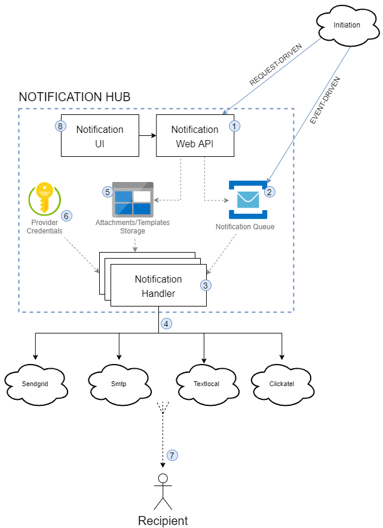
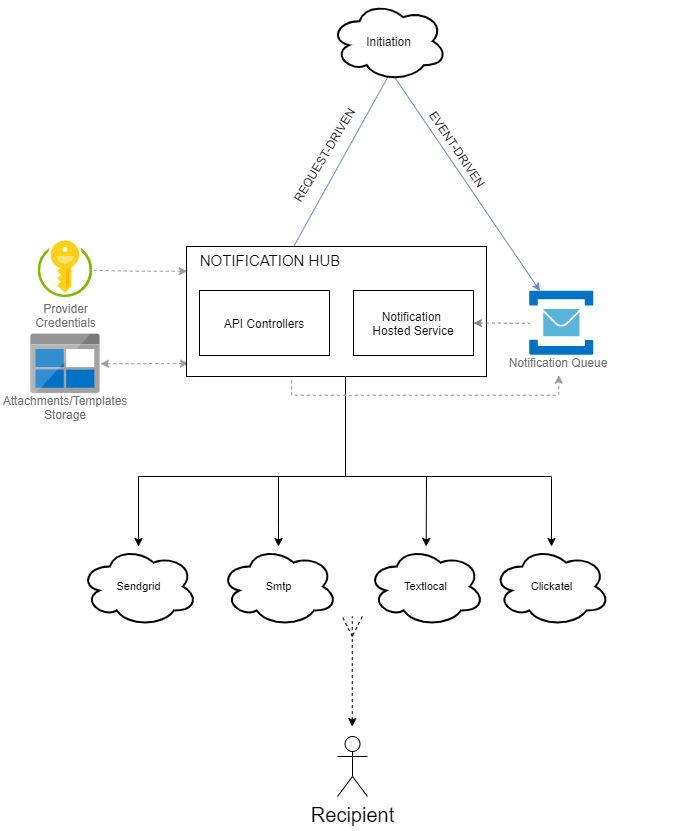
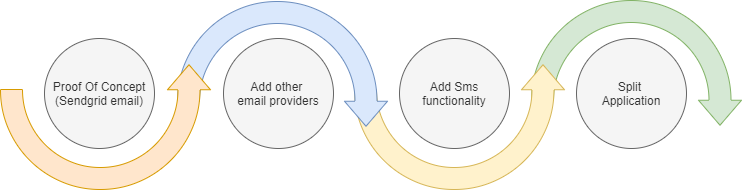

# Cloud.Core.NotificationHub

## Problem Description
There is a need from many solutions to send notifications for particular events. An example would be sending an Order Invoice email to a customer when an order is created or sending an Sms notifications tracking events i.e Order is being packed, Order shipped, Order is with the courier etc.

## Solution Overview
Development of a single “Notification Hub” microservice, that can exist on the evo platform, handling the brokering of multiple notification types to recipients.

The two examples mentioned above, email and sms, would be examples of notification types that can be generated but the hub will be extensible for future types.

The Notification Hub should be a true microservice that is self-sufficient (no coupling to other code bases in our solution), able to run independently and can be triggered by events (EDA) and triggered by requests (web API).

The following diagram outlines the proposed design:

1. Web API - request can be made to create a notification, if valid, it will add it to the queue.
2. Service Bus Queue - queue rather than topic as we don't need multiple subscribers to the same topic, we just need a single queue to work thought with regards sending notifications.
3. Notification Handler - reads the messages from the queue and sends the notification types to the recipient. The scalable part of the Notification Hub - if we want to speed up processing mails, then we can scale this part of the microservice.
4. Providers - integrations to provide the send functionality.
5. Storage - attachments will be kept in the storage, templates (when using SMTP) can be kept in storage also.
6. Secure Vault - provider credentials and azure service credentials can be stored securely in Key Vault.
7. Recipient delivery - end users receiving notifications.
8. User Interface - possible development of a user interface, where templates can be added and providers configured (future).

Worth noting that it is envisaged that the web API aspect will only create notification messages on the queue and not directly utilise the providers. This means that notification handler can have the singular purpose of dealing with the notification messages.

## Provider Integrations
There will be multiple options for integration with providers:

### Email
- SMTP - Relay Server
- Sendgrid

### Sms
- Sendgrid
- Textlocal
- Clickatel

Today we support SMTP and Sendgrid, so I suggest we start with those providers for email.

With regards Sms, we don’t do this today, so we could start by using Sendgrid, or alternatively could look at other providers such as Textlocal or Clickatel.

## Scalability
As mentioned above - the notification handler can be scaled independently from the API. Therefore if we need to process messages from the Notification queue quicker, we can scale up the number of instances handling the messages.

## Security
No credentials will be checked into the repository. Instead, provider credentials will be gathered from Key Vault. To access Key Vault, the applications in the Notification Hub should have MSI access. The same applies for the storage account.

## Geo-Replication
TBC - this may not be needed(?)

## Proof of Concept
The proof of concept will be a single application that does both the web API aspect and the event driven processing - this can later be split into two applications for the scalability needed. The code within will be segregated so it’s easier to split.

The proof of concept will only implement the Sendgrid email provider, to prove the application works as expected.

## Roadmap
The following roadmap will show the plan for continued development of the notification hub. There are no timelines associated with this as I have no clear indiciation of how important this work is, stacked up against other work that’s going on.

